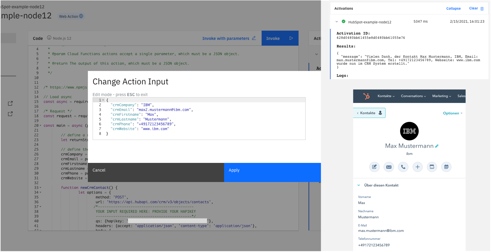

<h1 align="center" style="border-bottom: none;">:rocket: Watson Assistant & HubSpot CRM contacts</h1>
<h3 align="center">In this hands-on tutorial you will create a demo for Watson Assistant that is able to create new contacts in your HubSport CRM system, using the HubSpot API and the input you provide to Watson Assistant. The language of this Watson Assistant dialog skill is german.</h3>

## Prerequisites

1. Sign up for an [IBM Cloud account](https://cloud.ibm.com/registration).
2. Fill in the required information and press the „Create Account“ button.
3. After you submit your registration, you will receive an e-mail from the IBM Cloud team with details about your account. In this e-mail, you will need to click the link provided to confirm your registration.
4. Now you should be able to login to your new IBM Cloud account ;-)
5. If you haven't done so already, [sign up for HubSpot CRM](https://www.hubspot.com/products/crm), you can use the free version.

## Set up your HubSpot CRM Account

1. You will be required to set up your [developer account](https://developers.hubspot.com/).
2. Then you have to create a new API key - or hapikey - therefore, go to the settings icon in the main navigation bar --> Integrations --> API key and generate a new key.
Copy the generated API key and save it for later.

For more information you can access the [HubSpot API docs for the CRM](https://developers.hubspot.com/docs/api/crm/understanding-the-crm). The corresponding documentation to create a new contact can be found [here](https://developers.hubspot.com/docs/api/crm/contacts).

## Set up the Cloud Function

In your IBM Cloud account go to IBM Cloud Dashboard. Click the Cloud Functions button, then go to Actions and click create, to create a new action.


Give your action a name, keep the Default Package and choose Node.js - for instance 10 or 12 - as your runtime. Click create.


Copy and paste the `create-hubspot-crm-contacts.js` code. Now you need to provide your HubSpot API key / hapikey.

Check the line in the code where it says 'YOUR INPUT REQUIRED HERE' and provide your HubSpot API key / hapikey.



Now you can test your Cloud Function to make sure everything works fine. Therefore, save it and click Invoke with Parameters, provide the input below, and click Apply, then click Invoke. Results are shown in the Activations pane. In your HubSpot CRM system your new contact should be created.

```
{
  "crmCompany": "IBM",
  "crmEmail": "max.mustermann@ibm.com", 
  "crmFirstname": "Max",
  "crmLastname": "Mustermann",
  "crmPhone": "+49172123456789",
  "crmWebsite": "www.ibm.com",
}
```

Now go to Endpoints, enable it as a Web Action, save and copy the provided URL. You will need it later on, when setting up your Watson Assistant.


## Set up Watson Assistant on the IBM Cloud

In your IBM Cloud Account go to the dashboard by clicking the IBM Logo in the upper left. Go to Catalog and select the AI / Machine Learning category under services or search for Watson Assistant. Then create a new Watson Assistant service, the Lite Plan should work for this tutorial. 


Afterwards launch your Watson Assistant Service, you will find it on your dashboard under services.

Go to skills and create a new skill, when asked choose the dialog skill. Select import skill and upload the `skill-create-Jira-Issues.json` file.


Click options and then select Webhooks. Provide the Web Action URL you obtained when creating the Endpoint. Make sure to add a `.json` at the end.


Now you can go to the dialog and try it out for yourself. You can create a new issue and verify it in your Jira project.


## If you have any questions just contact me
Felix Augenstein<br>
Digital Tech Ecosystem & Developer Representative @IBM<br>
Twitter: [@F_Augenstein](https://twitter.com/F_Augenstein)<br>
LinkedIn: [linkedin.com/in/felixaugenstein](https://www.linkedin.com/in/felixaugenstein/)
